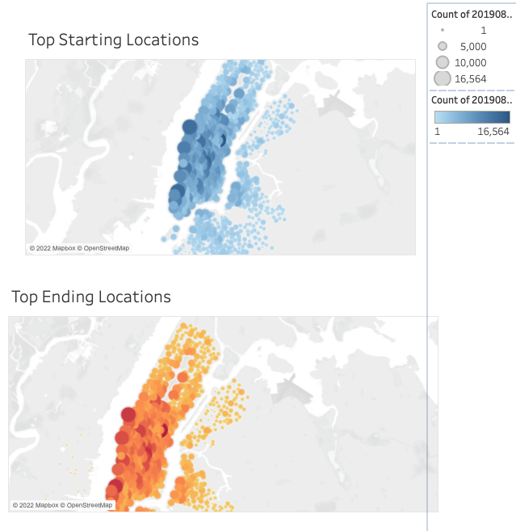
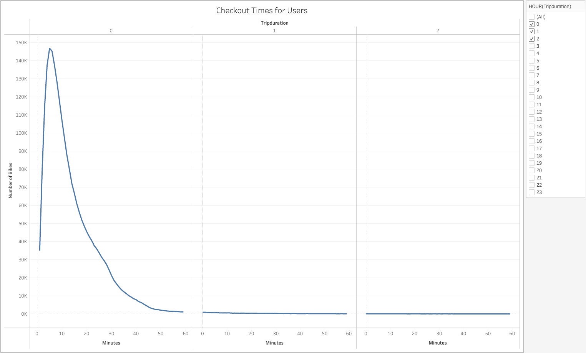
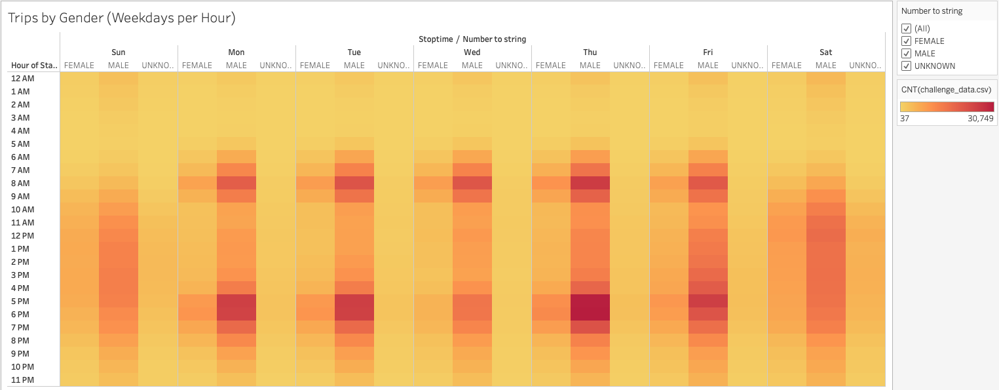

# Bike Sharing In Des Moines, Iowa
## Overview
We are trying to see if the bike share program would work in Iowa.
## Results
Next you will see some visualizations that we created with a note below.

This map show that in NYC most of the bikes are used around tourist areas. As you will see later it is show that they are used to get to and from work.

These show that mosted are use for short trips. It also show that males uses them by a big ratios of the others.

These show when they are used and by what gender.

This show that over whelmingly that it is the subscribers that use that bikes!
## Sumamary
As you can see above this program will work great for Iowa. We say this because must of the uses is to get to and from work. Plus with how much less busy Des Monie is it would work great to see stuff around the city.
link to the story
https://public.tableau.com/app/profile/charles.bolton5498/viz/nyc_16490256744420/NYCCitibike?publish=yes
